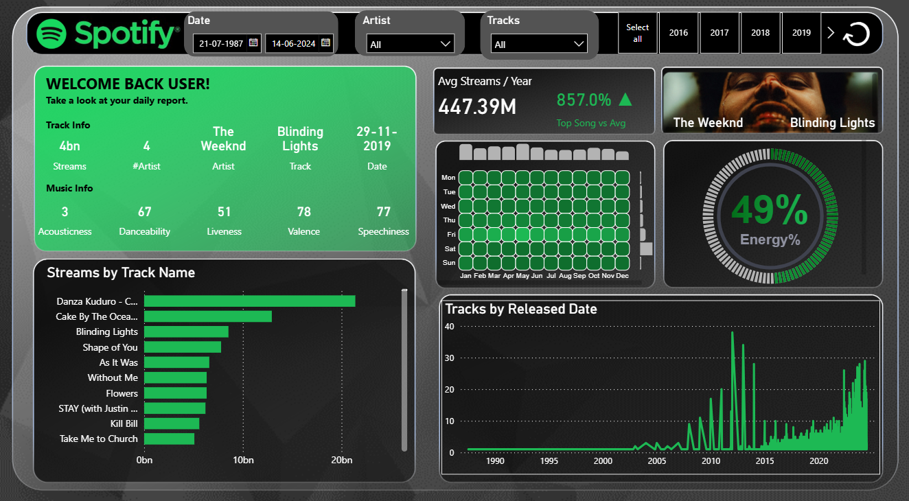

# Spotify Streaming Dashboard (Power BI)

This project presents a dynamic and visually compelling **Spotify Dashboard** built using **Power BI**, designed to analyze and visualize song performance and streaming trends upto 2024.

---

## Features

- **Interactive Date Range Selector**  
  Filter insights based on custom date ranges.

- **Track & Artist Filters**  
  Easily filter by specific artists or songs.

- **Track Info Summary Panel**  
  Displays top-streamed track data including:
  - Total Streams
  - Artist Name
  - Release Date
  - Acousticness, Danceability, Liveness, Valence, and Speechiness

- **Avg Streams per Year**  
  Compares top song streams to average annual streams.

- **Weekly Streaming Heatmap**  
  Shows listening activity across days and months.

- **Track Popularity Meter**  
  Visualizes song energy level.

- **Top 10 Streams by Track**  
  Horizontal bar chart for most-streamed tracks.

- **Tracks by Released Date**  
  Line graph visualizing the number of tracks released over the years.

---

## Tools Used

- **Power BI** for data visualization  
- **Python / Excel** (optional, for preprocessing)  
- **Spotify Dataset** (cleaned and structured)

---

## Insights You Can Derive

- Identify top-performing songs and artists.
- Analyze music characteristics and trends over time.
- Spot user behavior patterns based on day/month activity.
- Compare energy and engagement metrics for various tracks.

## Data Source

You can use publicly available Spotify streaming data (e.g., from Kaggle), or the one given in the repository itself.
